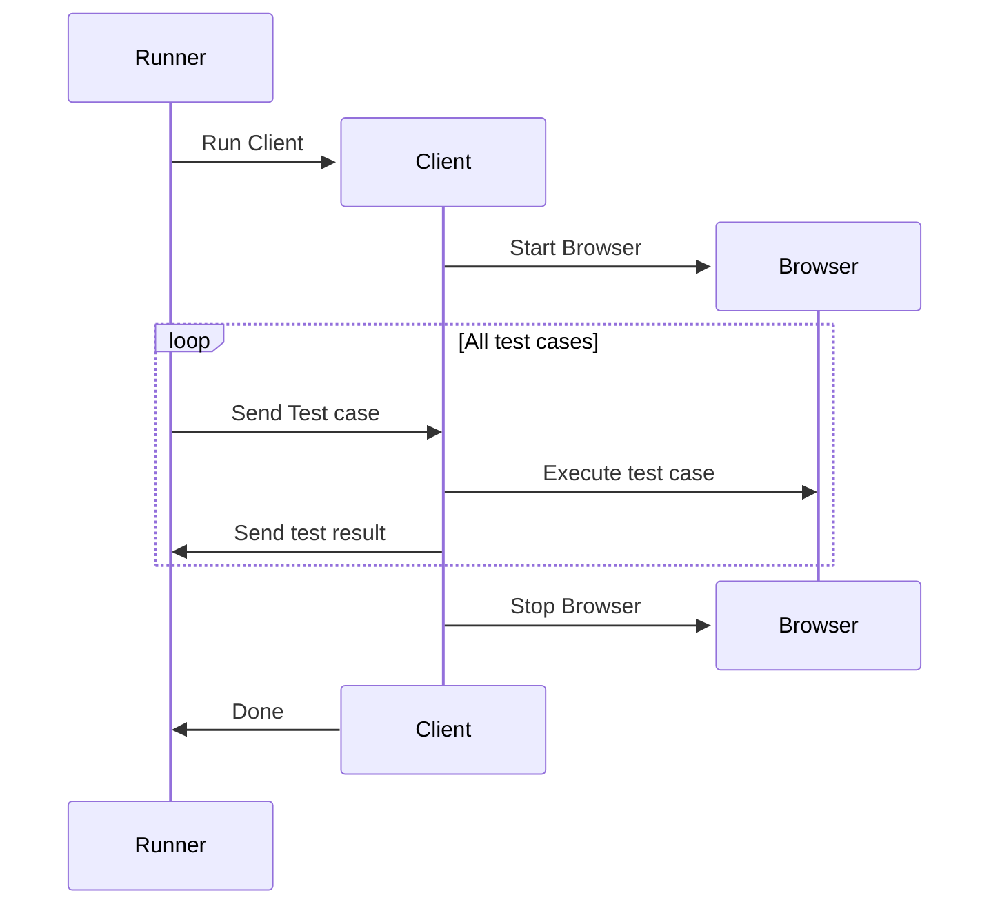
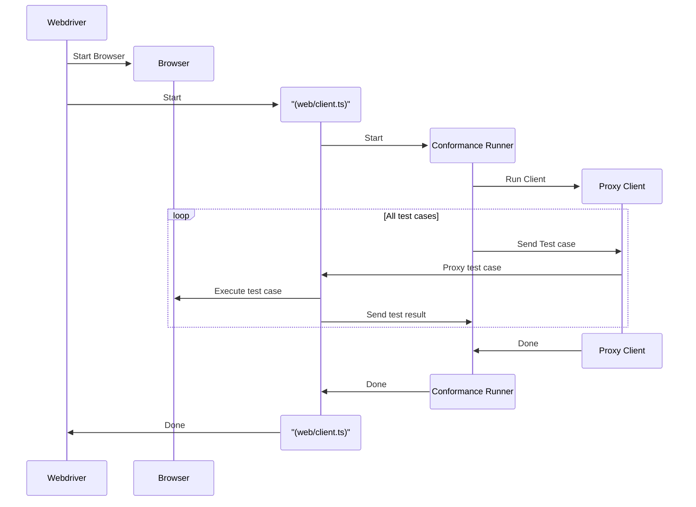

# Conformance tests for connect

This package provides test coverage for connect-es. It implements the conformance service described [here](https://buf.build/connectrpc/conformance).

It uses the [conformance runner](https://github.com/connectrpc/conformance/releases) to run the tests.

## `connect-web` Tests

The conformance runner sends the test config via stdin, and expects the test results on stdout. To make this work for browser-based tests, we make use of webdriver's [executeAsyncScript](https://webdriver.io/docs/api/webdriver#executeasyncscript) api to send the test config to the browser, and to retrieve the test results. The script that is executed in the browser is [web/entry.ts](src/web/entry.ts).

We can run the tests on a single browser using this API like so:

Unfortunately, this doesn't work with webdriver. The browser will take over the stdin/stdout. Even if it did work this has to repeat for each browser. We also need to run the tests on the browserstack. Webdriver has support for browserstack, but we need to utilize the test runner to run on borwser stack. So we change the flow:

