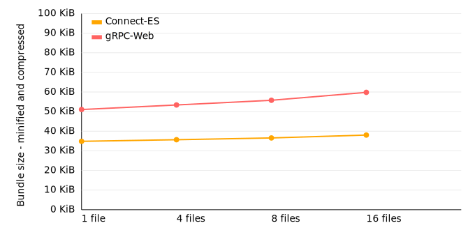

# Code size comparison

This is a simple code size comparison between Connect-ES and [gRPC-web](https://github.com/grpc/grpc-web).

We are generating code for the module [buf.build/bufbuild/registry](https://buf.build/bufbuild/registry)
once with gRPC-web, once with Connect-ES. Then we bundle a client calling an RPC
with [esbuild](https://esbuild.github.io/), minify the bundle, and compress it like a web server would
usually do. We repeat this for an increasing number of RPCs.

Tabular data

<!-- TABLE-START -->

| code generator | RPCs | bundle size |  minified | compressed |
| -------------- | ---: | ----------: | --------: | ---------: |
| Connect-ES     |    1 |   276,498 b | 176,488 b |   35,716 b |
| Connect-ES     |    4 |   280,750 b | 179,590 b |   36,547 b |
| Connect-ES     |    8 |   285,613 b | 184,021 b |   37,458 b |
| Connect-ES     |   16 |   294,741 b | 191,645 b |   38,978 b |
| gRPC-Web       |    1 |   876,563 b | 548,495 b |   52,300 b |
| gRPC-Web       |    4 |   928,964 b | 580,477 b |   54,673 b |
| gRPC-Web       |    8 | 1,004,833 b | 628,223 b |   57,118 b |
| gRPC-Web       |   16 | 1,124,155 b | 701,232 b |   61,248 b |

<!-- TABLE-END -->

