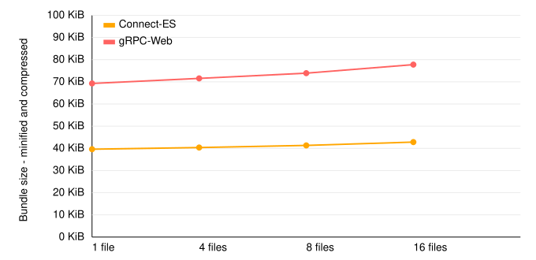

# Code size comparison

This is a simple code size comparison between Connect-ES and [gRPC-web](https://github.com/grpc/grpc-web).

We are generating code for the module [buf.build/bufbuild/registry](https://buf.build/bufbuild/registry)
once with gRPC-web, once with Connect-ES. Then we bundle a client calling an RPC
with [esbuild](https://esbuild.github.io/), minify the bundle, and compress it like a web server would
usually do. We repeat this for an increasing number of RPCs.

Tabular data

<!-- TABLE-START -->

| code generator | RPCs | bundle size |  minified | compressed |
| -------------- | ---: | ----------: | --------: | ---------: |
| Connect-ES     |    1 |   325,814 b | 195,259 b |   40,200 b |
| Connect-ES     |    4 |   330,066 b | 198,360 b |   41,055 b |
| Connect-ES     |    8 |   334,929 b | 202,790 b |   41,969 b |
| Connect-ES     |   16 |   344,057 b | 210,411 b |   43,435 b |
| gRPC-Web       |    1 | 1,080,604 b | 716,717 b |   70,467 b |
| gRPC-Web       |    4 | 1,131,993 b | 748,011 b |   72,862 b |
| gRPC-Web       |    8 | 1,207,404 b | 795,535 b |   75,345 b |
| gRPC-Web       |   16 | 1,326,175 b | 867,961 b |   79,393 b |

<!-- TABLE-END -->

