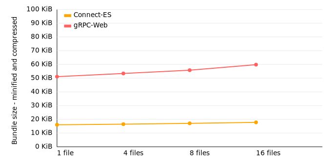

# Code size comparison

This is a simple code size comparison between Connect-ES and [gRPC-web](https://github.com/grpc/grpc-web).

We are generating code for the module [buf.build/bufbuild/registry](https://buf.build/bufbuild/registry)
once with gRPC-web, once with Connect-ES. Then we bundle a client calling an RPC
with [esbuild](https://esbuild.github.io/), minify the bundle, and compress it like a web server would
usually do. We repeat this for an increasing number of RPCs.

Tabular data

<!-- TABLE-START -->

| code generator | RPCs | bundle size |  minified | compressed |
| -------------- | ---: | ----------: | --------: | ---------: |
| Connect-ES     |    1 |   285,007 b | 180,536 b |   36,523 b |
| Connect-ES     |    4 |   289,259 b | 183,638 b |   37,365 b |
| Connect-ES     |    8 |   294,122 b | 188,069 b |   38,271 b |
| Connect-ES     |   16 |   303,250 b | 195,696 b |   39,724 b |
| gRPC-Web       |    1 | 1,070,505 b | 707,341 b |   70,184 b |
| gRPC-Web       |    4 | 1,121,879 b | 738,633 b |   72,562 b |
| gRPC-Web       |    8 | 1,197,272 b | 786,157 b |   75,059 b |
| gRPC-Web       |   16 | 1,316,009 b | 858,582 b |   78,955 b |

<!-- TABLE-END -->

