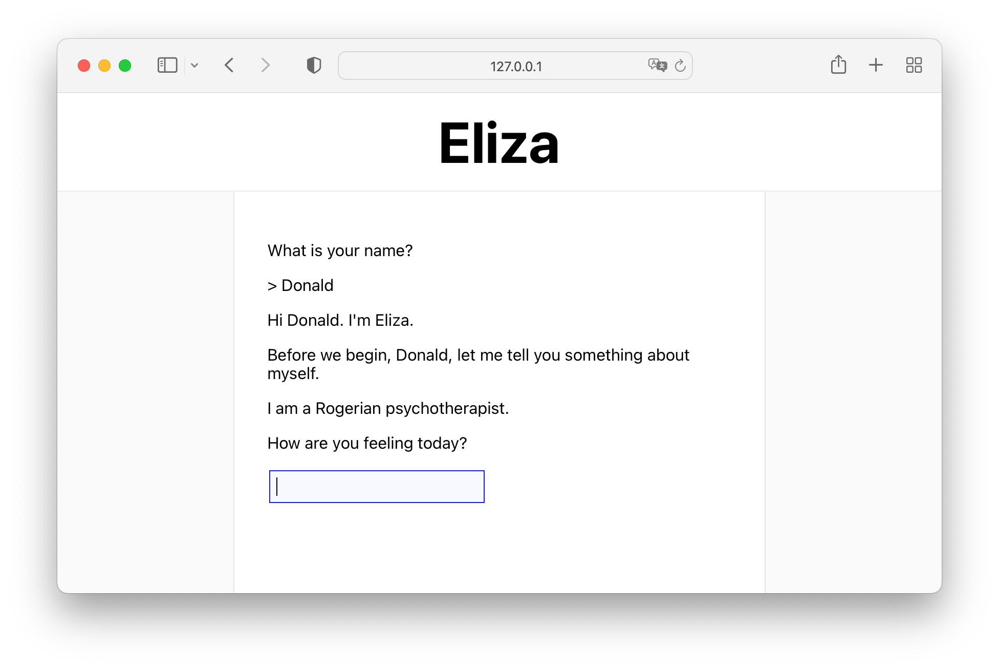

# Code example

This directory contains a simple example for running a Connect client from your web browser and a
client from your terminal against a server running in Node.js.

The application is a stripped-down version of [ELIZA](https://en.wikipedia.org/wiki/ELIZA), a very
simple natural language processor built in the 1960s to represent a psychotherapist.

You can find the protocol buffer schema [on the BSR](https://buf.build/connectrpc/eliza/file/main:connectrpc/eliza/v1/eliza.proto).

## Run the example

You will need [Node](https://nodejs.org/en/download/) in version 16 or later installed. Download
the example project and install its dependencies:

```shell
curl -L https://github.com/connectrpc/connect-es/archive/refs/heads/main.zip > connect-es-main.zip
unzip connect-es-main.zip 'connect-es-main/packages/example/*'

cd connect-es-main/packages/example
npm install
```

Next, we are going to make a locally-trusted development certificates with `mkcert`.
If you don't have it installed yet, please run the following commands:

```shell
brew install mkcert
mkcert -install
mkcert localhost 127.0.0.1 ::1
export NODE_EXTRA_CA_CERTS="$(mkcert -CAROOT)/rootCA.pem"
```

If you don't use macOS or `brew`, see the [mkcert docs](https://github.com/FiloSottile/mkcert#installation)
for instructions. You can copy the last line to your `~/.zprofile` or `~/.profile`, so that
the environment variable for Node.js is set every time to open a terminal.

If you already use `mkcert`, just run `mkcert localhost 127.0.0.1 ::1` to issue a certificate
for our example server.

Once we have that out of the way, let's start the Connect server:

```shell
npm start
```

That's it! You should now be able to open a web browser to https://localhost:8443 and see the
example running locally.



## Using Node.js as a client

The file `src/client.ts` implements a CLI client that you can run in Node.js.

```shell
$ npm run client
```

```
What is your name?
> John
Hi John, I'm eliza
Before we begin, John, let me tell you something about myself.
I'm a Rogerian psychotherapist.
How are you feeling today?
> █
```

## Using other clients

Because Connect is POST-only protocol that works over HTTP/1.1 and HTTP/2, we can also use
`curl` to call our RPC:

```shell
curl \
  --header 'Content-Type: application/json' \
  --data '{"sentence": "I feel happy."}' \
   https://localhost:8443/connectrpc.eliza.v1.ElizaService/Say
```

We can also use any gRPC client like `buf curl`:

```shell
npx buf curl --protocol grpc --schema . -d '{"name": "John"}' \
   https://localhost:8443/connectrpc.eliza.v1.ElizaService/Introduce
```

## Generate code

If you make changes to `eliza.proto`, make sure to re-generate the code. For example, you could rename a field, or
add a procedure. To do so, run `npx buf generate` in this directory.

This will generate the service definitions and message types into the directory `src/gen`. The
[`buf.gen.yaml` file](./buf.gen.yaml) contains the plugin configuration.

Of course, you can use `protoc` as well if desired:

```bash
protoc -I . eliza.proto \
  --plugin=protoc-gen-es=../../node_modules/.bin/protoc-gen-es \
  --es_out src/gen \
  --es_opt target=ts
```

## More examples

To get started, head over to the [docs](https://connectrpc.com/docs/web/getting-started)
for a tutorial. You will also find API documentation and best practices there.
For using Connect with your favorite framework, take a look at [Connect-ES Examples](https://github.com/connectrpc/examples-es).
